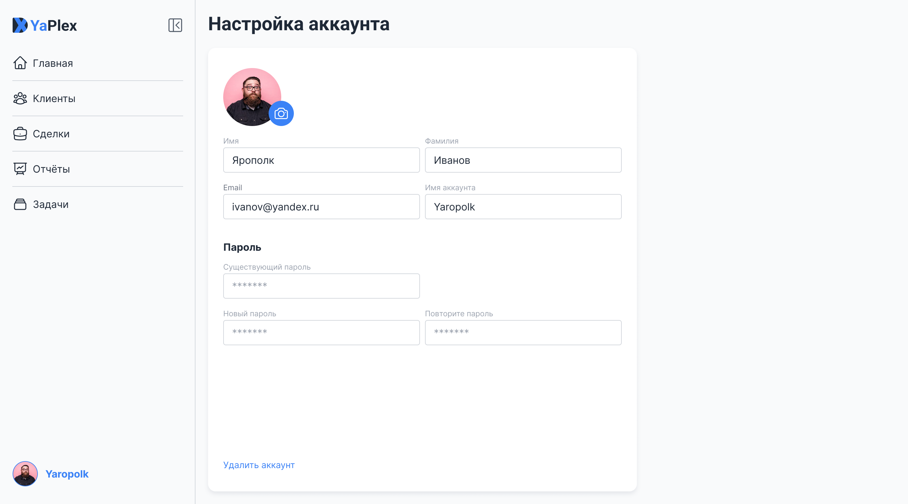

Create a User Profile page
Settings form:
email;
password;
name.

Coding Style
All code is formatted using Prettier.
All imports are sorted.
All HTML attributes are sorted.
ESLint is configured in the project and does not return any errors.
All variables in the project are written in CamelCase and reflect the meaning of the content.
All types in the project are named consistently and placed in a separate file.
If necessary, types are divided into separate files for each module.
Git commits must be meaningful and follow naming conventions.
The project repository has a well-formatted README.md.
Comments in the code must be meaningful and used only when it is impossible to describe behavior through variable and function names.
All console.log, alert, and debugger statements used during debugging have been removed.
There is no commented-out code in the project.
There are no inline styles, and the “!important” rule is not used.
There are no emojis or emoticons in the code, comments, or commit names.
The layout has no semantic errors. Appropriate tags are used for elements. For example, all links must be formatted using ```<a />```, and all forms using ```<form />```, etc.
The project code does not cause errors or warnings in the browser console.


Recommendations for forms: react-hook-form + zod
For pages with forms (clients, deals, tasks, profile), it’s convenient to use a validation scheme:
react-hook-form handles form data collection, error handling, and onSubmit processing.
zod defines field contracts (type, required status, formats) in one place and allows you to set normalization centrally.
If you choose this combination, connect zodResolver so that zod errors are automatically passed to react-hook-form.
Best practice:
Perform validation based on the schema, not “in situ” within handlers. This makes errors predictable and easier to test.
For text fields (e.g., comments), it’s helpful to normalize input at the schema level: use trim() and remove spaces so that clean values are passed to the submit payload.
In edit mode, use defaultValues / reset so the form is populated with initial data.
Display errors next to the field (under the corresponding input), and mark required fields with an asterisk in the label.

Create a page using the form component and the avatar component. Place the components in the components folder. Put all support files and utilities in the utils folder. Place the types in the types folder.

profile page layout:


layout in JSX:
```
<div style={{alignSelf: 'stretch', alignSelf: 'stretch', padding: 20, background: '#F9FAFB', overflow: 'hidden', flexDirection: 'column', justifyContent: 'flex-start', alignItems: 'flex-start', gap: 20, display: 'inline-flex'}}>
  <div style={{color: '#1F2937', fontSize: 30, fontFamily: 'Roboto', fontWeight: '700', lineHeight: 36, wordWrap: 'break-word'}}>Настройка аккаунта</div>
  <div style={{width: 680, flex: '1 1 0', paddingLeft: 24, paddingRight: 24, paddingTop: 32, paddingBottom: 32, background: 'white', boxShadow: '0px 4px 8px #E5E7EB', borderRadius: 12, flexDirection: 'column', justifyContent: 'space-between', alignItems: 'flex-start', display: 'flex'}}>
    <div style={{alignSelf: 'stretch', flexDirection: 'column', justifyContent: 'flex-start', alignItems: 'flex-start', gap: 32, display: 'flex'}}>
      <div style={{width: 632, flexDirection: 'column', justifyContent: 'flex-start', alignItems: 'flex-start', gap: 16, display: 'flex'}}>
        <div style={{overflow: 'hidden', justifyContent: 'flex-start', alignItems: 'center', display: 'inline-flex'}}>
          
          <div style={{alignSelf: 'stretch', flexDirection: 'column', justifyContent: 'flex-end', alignItems: 'flex-start', gap: 8, display: 'inline-flex'}}>
            <div data-state="Default" data-type="Icon Solid" style={{height: 40, padding: 8, background: '#3B82F6', borderRadius: 32, flexDirection: 'column', justifyContent: 'center', alignItems: 'center', gap: 2, display: 'flex'}}>
              <div style={{width: 24, height: 24, position: 'relative', overflow: 'hidden'}}>
                <div style={{width: 24, height: 24, left: 0, top: 0, position: 'absolute', overflow: 'hidden'}}>
                  <div style={{width: 19.50, height: 16.50, left: 2.25, top: 3.75, position: 'absolute', outline: '1.50px white solid', outlineOffset: '-0.75px'}} />
                  <div style={{width: 11.26, height: 9, left: 7.50, top: 8.25, position: 'absolute', outline: '1.50px white solid', outlineOffset: '-0.75px'}} />
                </div>
              </div>
            </div>
          </div>
        </div>
        <div style={{alignSelf: 'stretch', justifyContent: 'flex-start', alignItems: 'center', gap: 8, display: 'inline-flex'}}>
          <div style={{width: 312, flexDirection: 'column', justifyContent: 'flex-start', alignItems: 'flex-start', gap: 2, display: 'inline-flex'}}>
            <div style={{alignSelf: 'stretch', color: '#9CA3AF', fontSize: 12, fontFamily: 'Inter', fontWeight: '400', lineHeight: 16, wordWrap: 'break-word'}}>Имя</div>
            <div data-state="Default" style={{alignSelf: 'stretch', paddingLeft: 14, paddingRight: 14, paddingTop: 8, paddingBottom: 8, background: 'white', borderRadius: 4, outline: '1px #D1D5DB solid', outlineOffset: '-1px', flexDirection: 'column', justifyContent: 'flex-start', alignItems: 'flex-start', gap: 2, display: 'flex'}}>
              <div style={{alignSelf: 'stretch', color: '#1F2937', fontSize: 16, fontFamily: 'Inter', fontWeight: '400', lineHeight: 24, wordWrap: 'break-word'}}>Ярополк</div>
            </div>
          </div>
          <div style={{width: 312, flexDirection: 'column', justifyContent: 'flex-start', alignItems: 'flex-start', gap: 2, display: 'inline-flex'}}>
            <div style={{alignSelf: 'stretch', color: '#9CA3AF', fontSize: 12, fontFamily: 'Inter', fontWeight: '400', lineHeight: 16, wordWrap: 'break-word'}}>Фамилия</div>
            <div data-state="Default" style={{alignSelf: 'stretch', paddingLeft: 14, paddingRight: 14, paddingTop: 8, paddingBottom: 8, background: 'white', borderRadius: 4, outline: '1px #D1D5DB solid', outlineOffset: '-1px', flexDirection: 'column', justifyContent: 'flex-start', alignItems: 'flex-start', gap: 2, display: 'flex'}}>
              <div style={{alignSelf: 'stretch', color: '#1F2937', fontSize: 16, fontFamily: 'Inter', fontWeight: '400', lineHeight: 24, wordWrap: 'break-word'}}>Иванов</div>
            </div>
          </div>
        </div>
        <div style={{alignSelf: 'stretch', justifyContent: 'flex-start', alignItems: 'center', gap: 8, display: 'inline-flex'}}>
          <div style={{width: 312, flexDirection: 'column', justifyContent: 'flex-start', alignItems: 'flex-start', gap: 2, display: 'inline-flex'}}>
            <div style={{alignSelf: 'stretch', color: '#6B7280', fontSize: 12, fontFamily: 'Inter', fontWeight: '400', lineHeight: 16, wordWrap: 'break-word'}}>Email</div>
            <div data-state="Default" style={{alignSelf: 'stretch', paddingLeft: 14, paddingRight: 14, paddingTop: 8, paddingBottom: 8, background: 'white', borderRadius: 4, outline: '1px #D1D5DB solid', outlineOffset: '-1px', flexDirection: 'column', justifyContent: 'flex-start', alignItems: 'flex-start', gap: 2, display: 'flex'}}>
              <div style={{alignSelf: 'stretch', color: '#1F2937', fontSize: 16, fontFamily: 'Inter', fontWeight: '400', lineHeight: 24, wordWrap: 'break-word'}}>ivanov@yandex.ru</div>
            </div>
          </div>
          <div style={{width: 312, flexDirection: 'column', justifyContent: 'flex-start', alignItems: 'flex-start', gap: 2, display: 'inline-flex'}}>
            <div style={{alignSelf: 'stretch', color: '#9CA3AF', fontSize: 12, fontFamily: 'Inter', fontWeight: '400', lineHeight: 16, wordWrap: 'break-word'}}>Имя аккаунта</div>
            <div data-state="Default" style={{alignSelf: 'stretch', paddingLeft: 14, paddingRight: 14, paddingTop: 8, paddingBottom: 8, background: 'white', borderRadius: 4, outline: '1px #D1D5DB solid', outlineOffset: '-1px', flexDirection: 'column', justifyContent: 'flex-start', alignItems: 'flex-start', gap: 2, display: 'flex'}}>
              <div style={{alignSelf: 'stretch', color: '#1F2937', fontSize: 16, fontFamily: 'Inter', fontWeight: '400', lineHeight: 24, wordWrap: 'break-word'}}>Yaropolk</div>
            </div>
          </div>
        </div>
      </div>
      <div style={{alignSelf: 'stretch', flexDirection: 'column', justifyContent: 'flex-start', alignItems: 'flex-start', gap: 12, display: 'flex'}}>
        <div style={{color: '#1F2937', fontSize: 16, fontFamily: 'Inter', fontWeight: '700', lineHeight: 24, wordWrap: 'break-word'}}>Пароль</div>
        <div style={{alignSelf: 'stretch', flexDirection: 'column', justifyContent: 'flex-start', alignItems: 'flex-start', gap: 16, display: 'flex'}}>
          <div style={{width: 312, flexDirection: 'column', justifyContent: 'flex-start', alignItems: 'flex-start', gap: 2, display: 'flex'}}>
            <div style={{alignSelf: 'stretch', color: '#9CA3AF', fontSize: 12, fontFamily: 'Inter', fontWeight: '400', lineHeight: 16, wordWrap: 'break-word'}}>Существующий пароль</div>
            <div data-state="Placeholder" style={{width: 312, paddingLeft: 14, paddingRight: 14, paddingTop: 8, paddingBottom: 8, background: 'white', borderRadius: 4, outline: '1px #D1D5DB solid', outlineOffset: '-1px', flexDirection: 'column', justifyContent: 'flex-start', alignItems: 'flex-start', gap: 2, display: 'flex'}}>
              <div style={{alignSelf: 'stretch', color: '#9CA3AF', fontSize: 16, fontFamily: 'Inter', fontWeight: '400', lineHeight: 24, wordWrap: 'break-word'}}>*******</div>
            </div>
          </div>
          <div style={{alignSelf: 'stretch', justifyContent: 'flex-start', alignItems: 'flex-start', gap: 8, display: 'inline-flex'}}>
            <div style={{width: 312, flexDirection: 'column', justifyContent: 'flex-start', alignItems: 'flex-start', gap: 2, display: 'inline-flex'}}>
              <div style={{alignSelf: 'stretch', color: '#9CA3AF', fontSize: 12, fontFamily: 'Inter', fontWeight: '400', lineHeight: 16, wordWrap: 'break-word'}}>Новый пароль</div>
              <div data-state="Placeholder" style={{alignSelf: 'stretch', paddingLeft: 14, paddingRight: 14, paddingTop: 8, paddingBottom: 8, background: 'white', borderRadius: 4, outline: '1px #D1D5DB solid', outlineOffset: '-1px', flexDirection: 'column', justifyContent: 'flex-start', alignItems: 'flex-start', gap: 2, display: 'flex'}}>
                <div style={{alignSelf: 'stretch', color: '#9CA3AF', fontSize: 16, fontFamily: 'Inter', fontWeight: '400', lineHeight: 24, wordWrap: 'break-word'}}>*******</div>
              </div>
            </div>
            <div style={{width: 312, flexDirection: 'column', justifyContent: 'flex-start', alignItems: 'flex-start', gap: 2, display: 'inline-flex'}}>
              <div style={{alignSelf: 'stretch', color: '#9CA3AF', fontSize: 12, fontFamily: 'Inter', fontWeight: '400', lineHeight: 16, wordWrap: 'break-word'}}>Повторите пароль</div>
              <div data-state="Placeholder" style={{alignSelf: 'stretch', paddingLeft: 14, paddingRight: 14, paddingTop: 8, paddingBottom: 8, background: 'white', borderRadius: 4, outline: '1px #D1D5DB solid', outlineOffset: '-1px', flexDirection: 'column', justifyContent: 'flex-start', alignItems: 'flex-start', gap: 2, display: 'flex'}}>
                <div style={{alignSelf: 'stretch', color: '#9CA3AF', fontSize: 16, fontFamily: 'Inter', fontWeight: '400', lineHeight: 24, wordWrap: 'break-word'}}>*******</div>
              </div>
            </div>
          </div>
        </div>
      </div>
      <div style={{alignSelf: 'stretch', height: 116}} />
    </div>
    <div style={{alignSelf: 'stretch', justifyContent: 'flex-start', alignItems: 'flex-end', gap: 8, display: 'inline-flex'}}>
      <div style={{color: '#3B82F6', fontSize: 14, fontFamily: 'Inter', fontWeight: '400', lineHeight: 20, wordWrap: 'break-word'}}>Удалить аккаунт</div>
    </div>
  </div>
</div>
```